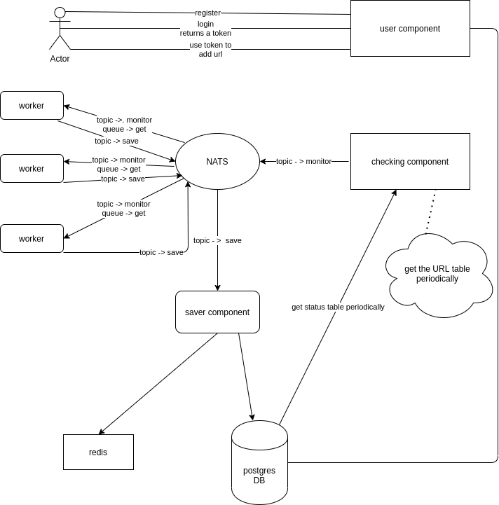

# sir-ping-a-lot 🎺

> *"I like big checks and I cannot lie."*

A microservice-based **HTTP monitoring system**. You hand it URLs, and a small
fleet of Go services keeps knighting around asking your endpoints the only
question that matters: **are you still alive?**

This repository is a monorepo merge of the (now archived) `httpmon/*` projects,
with the **full commit history of every service preserved**.

## Architecture

  

The system is split into small services that talk over [NATS](https://nats.io):

| Directory        | Role |
| ---------------- | ---- |
| [`user/`](user/)         | Public API — `Register`, `Login`, and adding URLs to monitor. |
| [`server/`](server/)     | Reads the URL table periodically and publishes each URL that needs checking to NATS. |
| [`checker/`](checker/)   | Subscribes to NATS, checks each URL's status, and publishes the result back. Runs as many instances. |
| [`saver/`](saver/)       | Bootstraps the database tables and persists the status results. |
| [`docs/`](docs/)         | The original project definition (LaTeX). |
| [`architecture/`](architecture/) | Architecture overview, diagram, and a top-level `docker-compose`. |

Each service keeps its own `go.mod` and remains independently buildable.

## History

This repo combines six previously separate repositories. Every commit from each
of them is retained — see `git log` and `git shortlog -sn`.

## Credits

Originally built by [raha](https://github.com/elahe-dastan), with mentoring from
[Parham Alvani](https://github.com/1995parham). Consolidated here for archival
and learning purposes.
